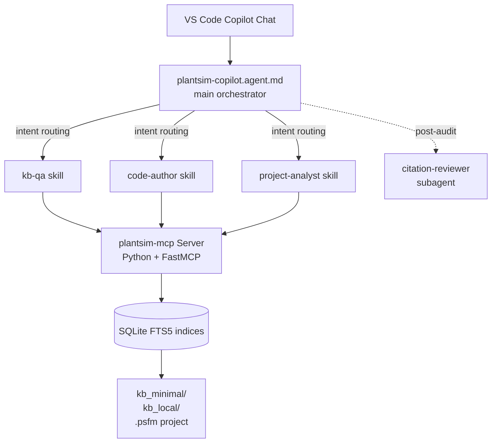

<div align="center">

[中文](README.md) · English

# 🏭 PlantSim-Agent

#### Bring AI assistance into the closed Siemens Plant Simulation ecosystem — knowledge-base Q&A, SimTalk code generation, and `.psfm` project analysis, all grounded in your own documentation


[Why This Exists](#-why-this-exists) · [What It Does](#-what-it-does) · [Quick Start](#-quick-start) · [Architecture](#-architecture-overview) · [Roadmap](./docs/roadmap.md)

</div>

---

## 🤔 Why This Exists

Siemens Plant Simulation is a powerhouse for discrete-event factory simulation, but its ecosystem is closed — the documentation isn't public, modelling conventions are scattered across forums, and the SimTalk 2.0 scripting language never made it into any mainstream LLM training corpus. So:

- ❌ General-purpose AI refuses to answer Plant Simulation questions
- ❌ Or hallucinates APIs, attributes, and objects that don't exist
- ❌ Or hands you deprecated SimTalk 1.0 syntax that no longer compiles
- ❌ It can't read your `.psfm` project, so "where is this method called?" is impossible to answer

**PlantSim-Agent** fixes that. It's a GitHub Copilot Custom Agent + MCP Server combo where every answer is grounded in **your own documentation** and **your own project** — no fabrication.

## 📋 What It Does

| Capability | Example | Description |
|------------|---------|-------------|
| Knowledge-Base Q&A | "How does `Buffer.numMU` behave on a blocked station?" | Searches Help → answer with Help section citation |
| SimTalk Code Assistant | "Write a method that logs per-shift MU throughput to a DataTable" | Generates code + lists every API's source |
| `.psfm` Project Analysis | "Which methods call `InitPalletJackFleet`?" | Indexes the whole project → returns call sites with file locations |
| Citation Compliance Audit | Automatic post-check | A `citation-reviewer` subagent rejects answers that lack verifiable citations and forces a redo |

### Design Principles

- **Zero Siemens content shipped** — the repo ships only tooling; no copyrighted Help content is redistributed
- **Local indexing** — the MCP server builds SQLite FTS5 indices locally; queries never leave your machine
- **Traceable** — every answer carries a `**Sources:**` anchor pointing back to Help sections or code lines
- **Extensible** — the index layer is an abstract base class; the v0.2 vector-search upgrade (sentence-transformers + sqlite-vec) drops in without breaking callers

## 🚀 Quick Start

> ⚠️ **Status: pre-alpha (v0.1 in progress).** Phase 1 — repository scaffolding — is complete; agents, skills, and the MCP server are being built. Track progress in the [Roadmap](./docs/roadmap.md).

**1. Enable Windows Developer Mode** (one-time, no admin needed)

`Settings` → `Privacy & Security` → `For developers` → `Developer Mode: On`. This lets non-admin users create symbolic links.

**2. Clone to the recommended location**

```powershell
git clone https://github.com/JackySummerfield/plantsim-agent.git $HOME/.copilot/plantsim-agent
cd $HOME/.copilot/plantsim-agent
```

> ⚠️ **Do not clone into OneDrive / Dropbox / iCloud / Google Drive.** Cloud sync corrupts `.git/objects/`. GitHub is your remote — you don't need another sync layer on top.

**3. Install**

```powershell
.\scripts\install.ps1
```

The script creates symlinks under `~/.copilot/agents/` and `~/.copilot/skills/` pointing back to the repo, so edits in the repo are picked up by VS Code immediately — no copy step. Idempotent; rerun after every `git pull`.

**4. Register the MCP Server** (instructions land with Phase 2)

**5. Reload VS Code** (`Ctrl+Shift+P` → `Developer: Reload Window`)

`PlantSim-Agent` will appear in the Copilot Chat agent picker.

### Knowledge-Base Layout

The repo ships with two knowledge-base folders side-by-side with **very different visibility**:

| Folder | In git? | Contents |
|--------|---------|----------|
| [`kb_minimal/`](./kb_minimal/) | ✅ yes | Self-authored sample KB: SimTalk syntax cheat sheet, API name index, modelling-standards template. Lets anyone evaluate the agent immediately after cloning. **Contains no Siemens content.** |
| [`kb_local/`](./kb_local/) | ❌ fully gitignored | **Your private KB.** Drop markdown converted from your licensed Help, company-internal modelling standards, project templates, personal notes. The MCP indexes both folders together but `kb_local/` never leaves your machine. |

Full Help-to-markdown conversion workflow: [`docs/kb-build-guide.md`](./docs/kb-build-guide.md).

## ⚙️ Architecture Overview



The MCP server exposes 7 tools: `search_help`, `get_api`, `find_method`, `find_callers`, `get_object_graph`, `search_code`, `validate_simtalk`. See [`docs/architecture.md`](./docs/architecture.md) for the full design.

## 💬 Usage Examples

Open Copilot Chat in any VS Code workspace and select **PlantSim-Agent** from the agent picker (or type `/plantsim-copilot`):

```text
/plantsim-copilot How do I make a Worker ignore service requests during a break?
/plantsim-copilot Write a SimTalk method that logs per-shift MU throughput per station to a DataTable.
/plantsim-copilot In this .psfm project, find every method that calls InitPalletJackFleet.
```

## 🗺️ Roadmap

- **v0.1** — KB Q&A · SimTalk code authoring · `.psfm` read-only analysis · citation reviewer
- **v0.2** — Vector retrieval · `validate_simtalk` upgraded to lexer/parser · `.psfm` write-back with safety checks
- **v0.3+** — Call-graph visualisation · custom model backends · packaged as a VS Code extension

Full detail in [`docs/roadmap.md`](./docs/roadmap.md).

## 🤝 Contributing

Contributions are very welcome — this project benefits enormously from anyone who knows Plant Simulation well.

- Open an Issue before any large change
- ⚠️ **Do not submit any content extracted from Siemens documentation** (verbatim text, screenshots, table excerpts — none of it)
- Everything in `kb_minimal/` must be your own summary, not a paste from the Help

Formal contribution guidelines will land in Phase 4 (`docs/contributing.md`).

## ⚖️ Trademark & Copyright Notice

This project is **not affiliated with, endorsed by, or sponsored by Siemens AG or Siemens Industry Software Inc.** "Siemens", "Plant Simulation", "Tecnomatix", and "SimTalk" are trademarks of Siemens or its affiliates and are used here only for nominative reference.

This repository **does not redistribute** any Siemens documentation, the Plant Simulation Help, model libraries, or any other proprietary Siemens material. All knowledge-base content used by the agent is built locally by each user from their own licensed copy of the Help.

## 🌟 References & Credits

- Design inspired by [GitHub Copilot Custom Agents](https://code.visualstudio.com/docs/copilot/customization/custom-agents) and [Agent Skills](https://code.visualstudio.com/docs/copilot/customization/agent-skills)
- Tool protocol: [Model Context Protocol](https://modelcontextprotocol.io/)
- Tip of the hat to Steffen Bangsow — his books shaped the modelling vocabulary of an entire generation of Plant Simulation users
- Thanks to the SCC Forum, LinkedIn, and PSWiki Plant Simulation community for years of public knowledge sharing

## License

MIT — see [LICENSE](LICENSE).
