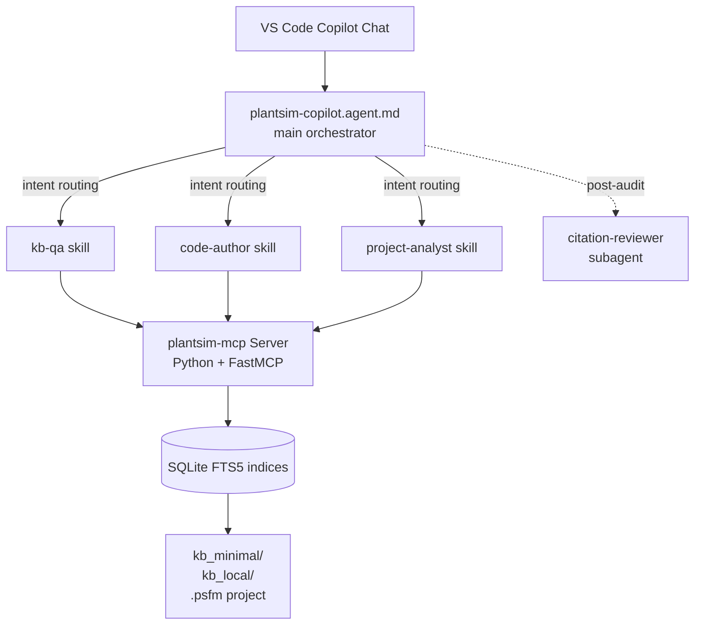

<div align="center">

[中文](README.md) · English

# 🏭 PlantSim-Agent

#### Bringing AI into the Plant Simulation ecosystem — help-doc Q&A, SimTalk coding, and `.psfm` project understanding


[Why This Exists](#-why-this-exists) · [What It Does](#-what-it-does) · [Quick Start](#-quick-start) · [Architecture](#-architecture-overview) · [Roadmap](./docs/roadmap.md)

</div>

---

## 🤔 Why This Exists

Plant Simulation is one of the most widely used discrete-event factory simulation tools, but its ecosystem is closed — the proprietary SimTalk scripting language, the lack of open-source community discussion and public learning material, and a built-in AI feature that is not yet generally available (and, when it is, may stay conservative). The consequences:

- ❌ It's hard to solve Plant Simulation problems with general-purpose LLMs directly
- ❌ APIs, attributes, and objects get fabricated out of thin air
- ❌ Deprecated SimTalk 1.0 syntax keeps surfacing
- ❌ AI can't truly participate in large simulation projects — there's no closed loop of *state requirement → modify code → verify behaviour*

**PlantSim-Agent** aims to fill that gap: a GitHub Copilot Custom Agent + MCP Server combo where every answer is grounded in the **Help documentation** and **your own coding conventions**, with no improvisation.

## 📋 What It Does

| Capability | Example | Description |
|------------|---------|-------------|
| Knowledge-Base Q&A | "How does `Buffer.numMU` behave on a blocked station?" | Searches Help → answer with Help section citation |
| SimTalk Code Assistant | "Write a method that logs per-shift MU throughput to a DataTable" | Generates code + lists the source of every API used |
| `.psfm` Project Parsing | "How does the AGV execute a transport task?" | Indexes the whole project → walks through code logic with file locations |

### Design Highlights

- **Intent routing** — the orchestrator agent classifies your question (docs lookup / code writing / project parsing), dispatches it to the right skill with the right conventions loaded — no manual `/kb-qa`, `/code-author` switching
- **Local KB indexing** — the MCP server builds SQLite FTS5 indices locally; queries never leave your machine
- **Traceable** — every answer carries a `**Sources:**` anchor pointing back to Help sections or code lines

## 🚀 Quick Start

> ✅ **Status: v0.1.0 released.** Ships 7 MCP tools, 3 skills, 2 agents (orchestrator + citation reviewer); 122 unit tests + 30/30 eval green. See the [Roadmap](./docs/roadmap.md) for v0.2.

**1. Clone to the recommended location**

```powershell
git clone https://github.com/JackySummerfield/plantsim-agent.git $HOME/.copilot/plantsim-agent
cd $HOME/.copilot/plantsim-agent
```

**2. Install**

```powershell
.\scripts\install.ps1
```

The script creates symlinks under `~/.copilot/agents/` and `~/.copilot/skills/` pointing back to the repo, so edits in the repo are picked up by VS Code immediately — no copy step. Idempotent; rerun after every `git pull`.

**3. Register the MCP Server** (instructions land with Phase 2)

**4. Reload VS Code** (`Ctrl+Shift+P` → `Developer: Reload Window`)

`PlantSim-Agent` will appear in the Copilot Chat agent picker.

### Knowledge-Base Layout

The repo ships with two knowledge-base folders side-by-side with **very different visibility**:

| Folder | In git? | Contents |
|--------|---------|----------|
| [`kb_minimal/`](./kb_minimal/) | ✅ yes | Sample KB: SimTalk syntax cheat sheet, API name index, modelling-standards template. **Contains nothing under proprietary copyright.** |
| [`kb_local/`](./kb_local/) | ❌ fully gitignored | **Your private KB.** Drop markdown converted from your licensed Help, company-internal modelling standards, project templates, personal notes. The MCP indexes both folders together but `kb_local/` never leaves your machine. |

Full Help-to-markdown conversion workflow: [`docs/kb-build-guide.md`](./docs/kb-build-guide.md).

## ⚙️ Architecture Overview



The MCP server exposes 7 tools: `search_help`, `get_api`, `find_method`, `find_callers`, `get_object_graph`, `search_code`, `validate_simtalk`. See [`docs/architecture.md`](./docs/architecture.md) for the full design.

## 💬 Usage Examples

Open Copilot Chat in any VS Code workspace and select **PlantSim-Agent** from the agent picker (or type `/plantsim-copilot`):

```text
/plantsim-copilot How do I make a Worker ignore service requests during a break?
/plantsim-copilot Write a SimTalk method that logs per-shift MU throughput per station to a DataTable.
/plantsim-copilot In this .psfm project, find every method that calls AGVFleet.
```

## 🗺️ Roadmap

- **v0.1** — KB Q&A · SimTalk code authoring · `.psfm` read-only analysis · citation reviewer
- **v0.2** — Vector retrieval · `validate_simtalk` upgraded to lexer/parser · `.psfm` write-back with safety checks
- **v0.3+** — Call-graph visualisation · custom model backends · packaged as a VS Code extension

Full detail in [`docs/roadmap.md`](./docs/roadmap.md).

## 🤝 Contributing

All Plant Simulation users are welcome to help improve the project~

## ⚖️ Trademark & Copyright Notice

This project is **not affiliated with, endorsed by, or sponsored by Siemens AG or Siemens Industry Software Inc.** "Siemens", "Plant Simulation", "Tecnomatix", and "SimTalk" are trademarks of Siemens or its affiliates and are used here only for nominative reference.

This repository **does not redistribute** any Siemens documentation, the Plant Simulation Help, model libraries, or any other proprietary Siemens material. All knowledge-base content used by the agent is built locally by each user from the Help shipped with their own licensed copy of the software.

## 🌟 References & Credits

- Design inspiration: [GitHub Copilot Custom Agents](https://code.visualstudio.com/docs/copilot/customization/custom-agents) and [Agent Skills](https://code.visualstudio.com/docs/copilot/customization/agent-skills)
- Tool protocol: [Model Context Protocol](https://modelcontextprotocol.io/)
- Thanks to the SCC Forum, LinkedIn, and PSWiki Plant Simulation community for years of public knowledge sharing

## License

MIT — see [LICENSE](LICENSE).
