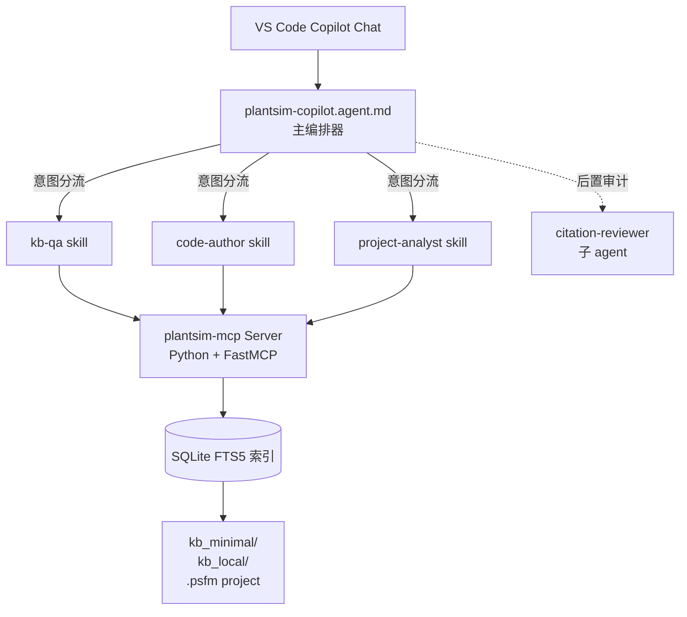

<div align="center">

中文 · [English](README.en.md)

# 🏭 PlantSim-Agent

#### 让 AI 加入 Plant Simulation 生态 —— 帮助文档问答、SimTalk 编程、`.psfm` 项目分析


[为什么做这个](#-为什么做这个) · [它能做什么](#-它能做什么) · [快速开始](#-快速开始) · [架构](#-架构总览) · [Roadmap](./docs/roadmap.md)

</div>

---

## 🤔 为什么做这个

Plant Simulation 是最受欢迎的工厂离散事件仿真软件之一，但它的生态是封闭的——独有的Simtalk编程语言、缺少开源社区讨论和公开学习资料、内置AI功能尚未开放(功能可能偏保守)。结果就是：

- ❌ 很难用通用LLM模型直接解决 Plant Simulation 相关问题
- ❌ 凭空捏造不存在的 API、属性、对象
- ❌ 给出已经废弃的 SimTalk 1.0 语法
- ❌ AI无法真正参与到大型仿真建模项目中来，形成提需求->修改代码->验证效果的闭环

**PlantSim-Agent** 希望能够弥补这一空白：一个 GitHub Copilot Custom Agent + MCP Server 的组合，所有回答都基于**帮助文档**和**你自己的编程规范**，绝不乱来。

## 📋 它能做什么

| 能力 | 触发示例 | 说明 |
|------|---------|------|
| 知识库问答 | "Buffer.numMU 在 station 阻塞时怎么变化？" | 检索 Help → 给答案 + 注明 Help 章节 |
| SimTalk 代码助手 | "写个方法记录每班次的 MU 吞吐量到 DataTable" | 生成代码 + 列出每个 API 的来源 |
| `.psfm` 项目解析 | "AGV是怎么执行搬运任务的？" | 索引整个项目 → 给代码逻辑 + 文件位置 |

### 设计要点

- **意图识别** — 主编排 agent 自动判断你的问题属于文档查询、代码编写、还是项目解析，分发到对应 skill 并加载相应规范，不用手动 `/kb-qa`、`/code-author` 来回切
- **知识库本地索引** — MCP Server 在你本地用 SQLite FTS5 建索引，问答全程不出机器
- **可追溯** — 每个答案都有 `**Sources:**` 锚点，链回 Help 章节或代码行

## 🚀 快速开始

> ⚠️ **状态：pre-alpha (v0.1 开发中)**。Phase 1 仓库骨架已完成；agent、skill、MCP server 正在建设。看 [Roadmap](./docs/roadmap.md) 追踪进度。

**1. Clone 到推荐位置**

```powershell
git clone https://github.com/JackySummerfield/plantsim-agent.git $HOME/.copilot/plantsim-agent
cd $HOME/.copilot/plantsim-agent
```

**2. 安装**

```powershell
.\scripts\install.ps1
```

脚本会在 `~/.copilot/agents/` 和 `~/.copilot/skills/` 下创建 symlink 指向仓库内的源文件——这样你编辑仓库里的文件 VS Code 立即看到，不需要拷贝同步。Idempotent，`git pull` 后重跑即可。

**3. 建索引** — 运行交互式向导

```powershell
# 已 pip install 后用 console-script：
plantsim-copilot-mcp init

# 没装也行——从仓库直接跑：
python scripts\build_kb.py
```

向导会问 4 件事：(1) markdown KB 根目录（默认带上 `kb_minimal/`，可加多个）；(2) 可选的 PTS Help fullmd 单文件源 + 要索引的章节；(3) 可选的默认 `.psfm` 项目；(4) 索引输出目录。结果写到 `~/.plantsim-agent/config.toml`，并可立即调用现有的索引器构建 `help.db` / `project.db`。

CI / 冷装机器可走非交互模式：

```powershell
plantsim-copilot-mcp init --non-interactive --kb-root .\kb_minimal --build
```

**4. 注册 MCP Server**（Phase 2 落地后说明）

**5. 重载 VS Code** (`Ctrl+Shift+P` → `Developer: Reload Window`)

`PlantSim-Agent` 会出现在 Copilot Chat 的 agent 选择器里。

### 知识库布局

仓库里有两个并排的知识库目录，**可见性完全不同**：

| 目录 | 进 git？ | 内容 |
|---|---|---|
| [`kb_minimal/`](./kb_minimal/) | ✅ 进 | 示例 KB：SimTalk 语法 cheat sheet、API 名称索引、建模规范模板。**不含任何涉及私有版权的内容。** |
| [`kb_local/`](./kb_local/) | ❌ 完全 gitignore | **你的私有 KB**。放从你自己授权版 Help 转出来的 markdown、公司内部建模规范、项目模板、个人笔记。MCP 把两个目录一起索引，但 `kb_local/` 永远不出你的机器。 |

完整的 Help → markdown 转换流程见 [`docs/kb-build-guide.md`](./docs/kb-build-guide.md)。

## ⚙️ 架构总览



MCP Server 暴露 7 个 tool：`search_help`、`get_api`、`find_method`、`find_callers`、`get_object_graph`、`search_code`、`validate_simtalk`。详见 [`docs/architecture.md`](./docs/architecture.md)。

## 💬 使用示例

打开任意 VS Code workspace 的 Copilot Chat，在 agent 选择器选 **PlantSim-Agent**（或输入 `/plantsim-copilot`）：

```text
/plantsim-copilot 怎么让 Worker 在 break 期间忽略服务请求？
/plantsim-copilot 写一个 SimTalk 方法，记录每班次每个 station 的 MU 吞吐量到 DataTable
/plantsim-copilot 在当前 .psfm 项目里，找出所有调用 AGVFleet 的方法
```

## 🗺️ Roadmap

- **v0.1** — KB 问答 · SimTalk 代码助手 · `.psfm` 只读分析 · 引用审计
- **v0.2** — 向量检索 · `validate_simtalk` 升级到 lexer/parser 级 · `.psfm` 写回 + 安全校验
- **v0.3+** — 调用图可视化 · 自定义模型后端 · 打包成 VS Code 扩展

完整内容见 [`docs/roadmap.md`](./docs/roadmap.md)。

## 🤝 贡献

欢迎所有 Plant Simulation 用户参与项目改进~

## ⚖️ 商标与版权声明

本项目**与 Siemens AG 及 Siemens Industry Software Inc. 没有任何隶属、背书或赞助关系**。"Siemens"、"Plant Simulation"、"Tecnomatix"、"SimTalk" 均为 Siemens 或其关联公司的商标，此处仅作指代使用。

仓库本身**不分发**任何 Siemens 文档、Plant Simulation Help、模型库或其他 Siemens 专有材料。Agent 使用的所有 KB 内容由每位用户基于自己授权软件的 Help 在本地构建。

## 🌟 References & Credits

- 设计灵感：[GitHub Copilot Custom Agents](https://code.visualstudio.com/docs/copilot/customization/custom-agents) 和 [Agent Skills](https://code.visualstudio.com/docs/copilot/customization/agent-skills)
- 工具协议：[Model Context Protocol](https://modelcontextprotocol.io/)
- 感谢 SCC Forum、LinkedIn 和 PSWiki 上的 Plant Simulation 社区多年的公开分享

## License

MIT — 见 [LICENSE](LICENSE)。
